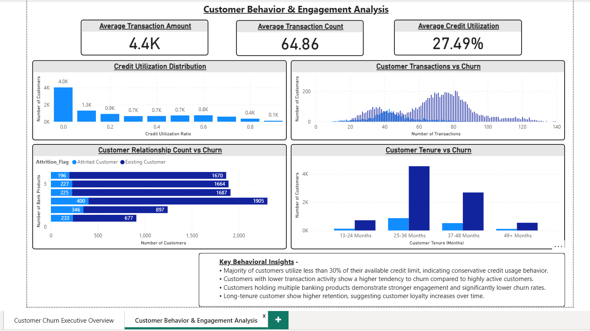

# Credit Card Customer Churn Analysis

## Project Overview

Customer churn is a major concern for financial institutions because retaining existing customers is significantly more cost-effective than acquiring new ones. Understanding the behavioral and demographic factors that contribute to churn enables banks to develop targeted retention strategies.

This project analyzes customer churn behavior in a credit card dataset containing over **10,000 customers**. The objective is to identify patterns in customer activity, demographics, and engagement that influence churn.

The analysis combines **Excel, Python, SQL, and Power BI** to perform end-to-end data analysis and build an interactive dashboard that provides actionable business insights.

---

# Business Problem

Banks and financial institutions constantly face the challenge of customer attrition. Losing customers can directly impact long-term revenue and customer lifetime value.

This project aims to answer key business questions:

- What percentage of customers are leaving the bank?
- Which customer segments show the highest churn risk?
- Does income level or card category influence churn behavior?
- Do inactive customers show higher churn probability?
- How do customer transactions and credit utilization relate to churn?
- Do long-tenure customers demonstrate stronger loyalty?

Understanding these patterns allows organizations to design **data-driven retention strategies**.

---

# Dataset Information

Dataset used: **BankChurners**

Total Records: **10,127 customers**

Key attributes included in the dataset:

| Category | Variables |
|--------|--------|
| Customer Demographics | Age, Gender, Income Category, Education |
| Account Information | Card Category, Credit Limit |
| Customer Engagement | Months on Book, Relationship Count |
| Activity Metrics | Transaction Amount, Transaction Count |
| Credit Behavior | Credit Utilization Ratio |
| Churn Indicator | Attrition Flag |

The dataset provides both **behavioral and demographic information**, making it ideal for churn analysis.

---

# Project Workflow

This project follows a complete **data analytics pipeline**:

Dataset → Excel Analysis → Python EDA → SQL Analysis → Power BI Dashboard

Each stage contributes to understanding the data and generating insights.

---

# Tools and Technologies Used

| Tool | Purpose |
|------|------|
| Excel | Initial data inspection and exploratory summaries |
| Python (Pandas, Matplotlib, Seaborn) | Exploratory data analysis and visualization |
| SQL | Business query analysis and data exploration |
| Power BI | Interactive dashboard development |
| Markdown | Project documentation |

---

# Exploratory Data Analysis (Python)

Python was used to perform exploratory analysis and understand patterns within the dataset.

Key analyses performed:

- Distribution of customer age groups
- Credit utilization behavior
- Transaction patterns
- Relationship count distribution
- Churn distribution across customer segments

Libraries used:

Pandas
Matplotlib
Seaborn
NumPy

This stage helped identify important features influencing churn.

---

# SQL Analysis

SQL was used to perform **business-focused queries** to answer operational questions.

Examples of analysis performed:

- Total number of customers and churned customers
- Customer distribution across card categories
- Average credit limits by customer segment
- Transaction behavior across churned vs existing customers
- Customer tenure analysis

Example SQL query:

SELECT Attrition_Flag, COUNT(*) AS customer_count
FROM bank_churn
GROUP BY Attrition_Flag;

SQL helped transform raw data into **structured insights for business analysis**.

---

# Power BI Dashboard

An interactive dashboard was developed to visualize churn insights and support business decision-making.

The dashboard contains **two analytical pages**.

---

# Dashboard Page 1 – Executive Overview

This page provides a **high-level summary of churn patterns**.

Key metrics displayed:

- Total Customers
- Churned Customers
- Customer Churn Rate
- Average Credit Limit
- Average Customer Tenure

Key visual analyses:

- Overall churn distribution
- Churn by card category
- Churn by income segment
- Churn trends across age groups
- Customer inactivity vs churn

These visuals help executives quickly understand **where churn is occurring**.

---

# Dashboard Page 2 – Customer Behavior & Engagement Analysis

This page focuses on **behavioral drivers of churn**.

Key behavioral KPIs:

- Average Transaction Amount
- Average Transaction Count
- Average Credit Utilization Ratio

Key behavioral analyses:

- Credit utilization distribution
- Customer transaction activity vs churn
- Relationship count vs churn
- Customer tenure vs churn

This page helps identify **behavioral signals associated with customer retention or churn**.

---

# Key Insights

The analysis revealed several important patterns:

- The overall customer churn rate is approximately **16%**.
- Most customers utilize **less than 30% of their credit limit**, indicating conservative credit usage.
- Customers with **low transaction activity are significantly more likely to churn**.
- Customers holding **multiple banking products demonstrate stronger engagement and lower churn rates**.
- Long-tenure customers show **higher retention**, suggesting that loyalty increases with relationship duration.
- Premium card categories show **different churn patterns compared to standard cardholders**.

---

# Business Recommendations

Based on the analysis, the following strategies could help reduce churn:

### Improve Customer Engagement
Customers with low transaction activity are more likely to churn. Banks should encourage card usage through rewards programs and targeted promotions.

### Cross-Sell Additional Products
Customers with multiple banking relationships show lower churn rates. Offering bundled services could increase customer retention.

### Monitor Inactive Customers
Early identification of inactive customers can help prevent churn through personalized retention campaigns.

### Reward Loyal Customers
Long-tenure customers demonstrate stronger loyalty and should be prioritized through loyalty programs.

---

# Project Structure

Credit-Card-Churn-Analysis
│
├── Dataset
│ └── BankChurners.csv
│
├── Excel
│ └── Excel_Analysis.xlsx
│
├── Python-EDA
│ └── churn_analysis.ipynb
│
├── SQL
│ ├── 01_database_setup.sql
│ ├── 02_table_creation.sql
│ ├── 03_data_verification.sql
│ ├── 04_business_queries.sql
│ └── SQL_Query_Documentation.md
│
├── PowerBI
│ └── Credit-Card-Churn-Analysis-Dashboard.pbix
│
├── Screenshots
│ ├── Customer-Churn-Dashboard-Executive-Overview.png
│ └── Customer-Churn-Dashboard-Behavior-Analysis.png
│
└── README.md

---

# Dashboard Preview

## Executive Overview

## Customer Behavior Analysis

---

# Skills Demonstrated

This project demonstrates several core data analytics skills:

- Data Cleaning and Preparation
- Exploratory Data Analysis
- SQL Query Development
- Business Intelligence Dashboard Design
- Data Visualization and Storytelling
- Customer Behavior Analysis
- Business Insight Generation

---

# Conclusion

This project demonstrates how data analytics can be used to understand customer churn behavior in the financial services industry.

By combining demographic, behavioral, and transactional data, the analysis highlights key factors that influence customer retention. The insights derived from this project can support financial institutions in developing targeted strategies to improve customer engagement and reduce churn.

---

# Author

**Aatreya Pal**

B.Com Graduate | Aspiring Data Analyst  

Skills: SQL, Python, Power BI, Excel, Data Visualization, Business Analytics  

LinkedIn: (in/aatreya-pal-403ba8237)  
